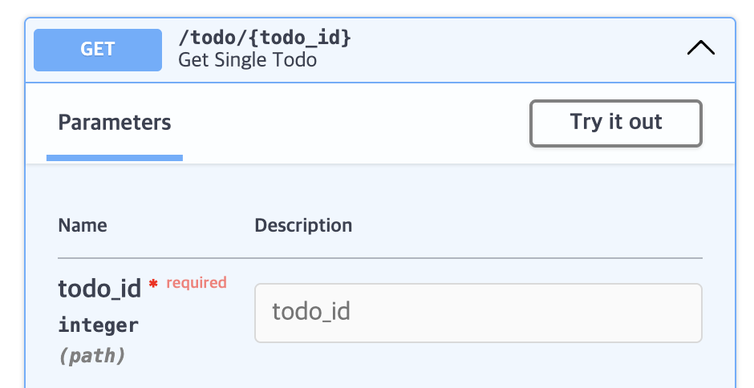

# LV2 
251231

> **!! uvicorn 서버 시작법**
> 
> ```unicornn api:app --port 8000 --reload```

# 라우터
> 서버로 전송된 요청을 처리하는 함수
> 
> ex) 서버로 전송된 요청을 처리

### 기본 과정
> 1. todo.py 작성 (여기서 라우터 만들거임)
> 2. api.py에 import 추가
> ```from todo import todo_router```

### GET 요청
```curl -X GET http://127.0.0.1:8000/todo -H "accept:application/json"```
### POST 요청
```
curl -X POST http://127.0.0.1:8000/todo \
  -H "accept: application/json" \
  -H "Content-Type: application/json" \
  -d '{"id": 1, "item": "First Todo is to finish this book!"}'
```
### pydantic 모델
- 정의된 데이터만 전송되도록 바디를 검증
``` from pydantic import BaseModel ```
- model.py 만들고, 코드 추가해서 유효성 검증 가능하도록 함.
  - todo.py(라우터)에서 import 해서 쓰면 됨

### pydantic 클래스 정의
```model.py
from pydantic Import BaseModel

class Todo(BaseModel):
    id: int
    item: str
```

### pydantic 중첩 모델
```model.py
class Item(BaseModel):
    Item: str
    status: str

class Todo(BaseModel):
    id: int
    item: Item
```
* 중첩해서 사용 가능하다는 건 확인했지만, ```item: str```으로 계속 쓰자

### 경로 매개변수
```todo_router.post("/todo/{todo_id}")```

### Path 파라미터

이렇게 swagger 문서에 필수값, 설명 등등을 

# get 요청 with 경로 매개변수 (todo.py)
```python
@todo_router.get("/todo/{todo_id}")
async def get_single_todo(todo_id: int) -> dict:
    for todo in todo_list:
        if todo.id == todo_id:
            return{
                "todo":todo
            }
    return {
        "message":"Todo not found"
    }
```
### GET 요청으로 테스트
```bash
curl -X 'GET' \
'http://127.0.0.1:8000/todo/1' \
-H 'accept: application/json'
```
