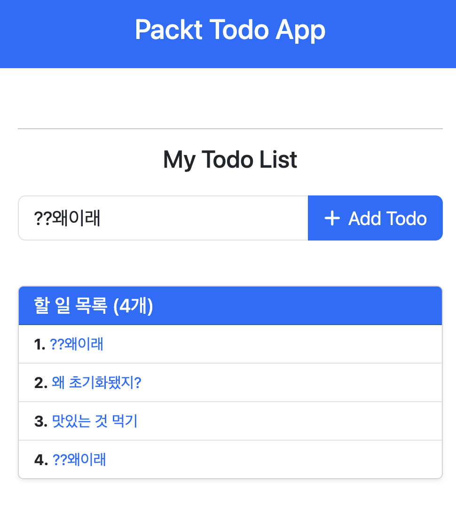

# LV4
# 템플릿팅
- API 데이터를 화면에 표시
- 프론트엔드 컴포넌트처럼 처리
- Jinja 템플릿
  - 파이썬 모든 유형의 객체를 템플릿 변수로 사용 가능
  - 모델, 리스트, 딕셔너리
  - 문자열 수정 등을 Jinja에서 사용할 수 없음 -> 필터 사용 필요
필터 사용 예시
```py
{{ variable| filter_name(*args)}}
```
또는
```py
{{varibable | filter_name}}
```
1. ``````
- 구조 제어 명령
2. ```{{todo.item}}```
- 식의 값 전달
3. ```{#주석#}```
- 주석 기입 시 사용
- 웹페이지에는 표시안됨

# 자주 사용되는 필터
### 기본 필터
- 전달된 값이 None일 때
```py
{{todo.item|default('기본 아이템 입니다_todo')}}
```

### 이스케이프 필터
- HTML을 변환치않고 그대로 렌터링
```py
{{"<title>Todo App</title>"|escape}}
```

### 변환 필터
```py
{{3.1415|int}}
{{31|float}}
```

### 병합 필터
```py
{{['A','B','C']|join(' ')}}
# 결과: A B C
```

### 길이 필터
```py
Todo count: {{todos|length}}
```

### if문
```py

    할 일이 5개 미만입니다.

    바쁜 날을 보내고 있군요. 파이팅.

```

### 반복문
```py

    <b> {{todo.item}} </b>

```

### 매크로
- 하나의 함수로 HTML 문자열 반환
```py
{%macro input(name, value='', type='text', size=20 %)}
    <div class="form">
        <input type="{{type}}" name="{{name}}"
        value="{{value|escape}}" size="{{size}}">
    </div>

# 호출방법(예시): {{input('item')}}
# 결과
<div class="form">
    <input type="text" name="item" value="" size="20">
```

### 템플릿 상속
- 중복 배제(DRY) 원칙에 근거
- 자식 템플릿 교체 가능

# Jinja2 사용하기
### 설치
```bash
pip install jinja2 python-multipart
mkdir templates
cd templates
touch {home,todo}.html
```
### POST 라우트 수정(todo.py)
```py
@todo_router.post("/todo", status_code=201)
#async def create_todo(todo: dict) -> dict: ## 유효성 검증을 위해, 입력값을 모델로 바꿀거임
async def create_todo(request: Request, todo: Todo = Depends(Todo.as_form)):
    todo.id = len(todo_list) + 1  # 간단한 ID 할당
    todo_list.append(todo)
    return templates.TemplateResponse("todo_created.html", {"request": request, "todo": todo_list})
```

### GET 라우트 수정
```py
@todo_router.get("/todo/{todo_id}")
async def get_single_todo(request: Request, todo_id: int = Path(..., Title="The ID of the todo to retrieve")) -> dict:
    for todo in todo_list:
        if todo.id == todo_id:
            return templates.TemplateResponse("todo.html", {"request": request, "todo": todo})
    # return {
    #     "message": "Todo not found",
    # }
    raise HTTPException(status_code=status.HTTP_404_NOT_FOUND, detail="Todo not found")
```

### model.py Config 서브클래스 추가
```py
from typing import Optional

class Todo(BaseModel):
    id: Optional[int]
    item: str

    @classmethod
    def as_form(cls, item: str = Form(...)):
        return cls(item=item)
```

# 전체 todo.py
```py
# 얘가 라우터 역할 하고있음
from fastapi import APIRouter, Path, HTTPException, status, Request, Depends
from fastapi.templating import Jinja2Templates
from fastapi.responses import RedirectResponse, HTMLResponse  # 추가
from model import Todo, TodoItem, TodoItems

todo_router = APIRouter()
todo_list = []
templates = Jinja2Templates(directory="templates/")

# @todo_router.post("/todo", status_code=201)
# #async def create_todo(todo: dict) -> dict: ## 유효성 검증을 위해, 입력값을 모델로 바꿀거임
# async def create_todo(todo: Todo) -> dict:
#     todo_list.append(todo)
#     return {
#         "message": "Todo created successfully",
#     }

# 최종 버전: 추가 후 목록 페이지로 리다이렉트 (PRG 패턴)
@todo_router.post("/todo")
async def create_todo(request: Request, todo: Todo = Depends(Todo.as_form)):
    todo.id = len(todo_list) + 1  # 간단한 ID 할당
    todo_list.append(todo)
    # 템플릿 직접 렌더링 대신 리다이렉트 → GET /todo 호출됨
    return RedirectResponse(url="/todo", status_code=303)


# 전체 목록 페이지 (브라우저에서 /todo 접속 시)
@todo_router.get("/todo", response_class=HTMLResponse)
async def retrieve_todos(request: Request):
    return templates.TemplateResponse(
        "todo.html",
        {"request": request, "todos": todo_list}
    )


# @todo_router.get("/todo/{todo_id}")
# async def get_single_todo(todo_id: int = Path(..., Title="The ID of the todo to retrieve")) -> dict:
#     for todo in todo_list:
#         if todo.id == todo_id:
#             return {
#                 "todo": todo,
#             }
#     # return {
#     #     "message": "Todo not found",
#     # }
#     raise HTTPException(status_code=status.HTTP_404_NOT_FOUND, detail="Todo not found")

# 개별 Todo 상세 페이지 (/todo/{todo_id})
@todo_router.get("/todo/{todo_id}", response_class=HTMLResponse)
async def get_single_todo(
    request: Request,
    todo_id: int = Path(..., title="The ID of the todo to retrieve")
):
    for todo in todo_list:
        if todo.id == todo_id:
            return templates.TemplateResponse(
                "todo.html",
                {"request": request, "todos": todo_list, "todo": todo}  # 전체 목록 + 현재 todo 전달
            )
    raise HTTPException(status_code=status.HTTP_404_NOT_FOUND, detail="Todo not found")


@todo_router.put("/todo/{todo_id}")
async def update_todo(
    todo_data: TodoItem,
    todo_id: int = Path(..., title="The ID of the todo to update")
) -> dict:
    for todo in todo_list:
        if todo.id == todo_id:
            todo.item = todo_data.item
            return {"message": "Todo updated successfully"}
    raise HTTPException(status_code=status.HTTP_404_NOT_FOUND, detail="Todo not found")


@todo_router.delete("/todo/{todo_id}")
async def delete_single_todo(todo_id: int) -> dict:
    for index in range(len(todo_list)):
        todo = todo_list[index]
        if todo.id == todo_id:
            todo_list.pop(index)
            return {"message": "Todo deleted successfully"}
    raise HTTPException(status_code=status.HTTP_404_NOT_FOUND, detail="Todo not found")


@todo_router.delete("/todo")
async def delete_all_todos() -> dict:
    todo_list.clear()
    return {"message": "All todos deleted successfully"}
```

# 전체 todo.html
```html



<main class="container">  <!-- 오타 수정: containter → container -->
    <div class="row justify-content-center">
        <div class="col-lg-8">

            <hr>
            <h2 class="text-center mb-4">My Todo List</h2>

            <!-- Todo 추가 폼 -->
            <form method="post" class="mb-5">
                <div class="input-group">
                    <input 
                        type="text" 
                        name="item" 
                        class="form-control form-control-lg" 
                        placeholder="새로운 할 일 입력..." 
                        aria-label="Todo Item" 
                        required
                    >
                    <button class="btn btn-primary btn-lg" type="submit">
                        <i class="fas fa-plus me-2"></i>Add Todo
                    </button>
                </div>
            </form>

            <!-- 전체 Todo 목록 -->
            <div class="card shadow-sm">
                <div class="card-header bg-primary text-white">
                    <h5 class="mb-0">할 일 목록 ({{ todos|length }}개)</h5>
                </div>
                <ul class="list-group list-group-flush">
                    
                        
                        <li class="list-group-item d-flex justify-content-between align-items-center">
                            <span>
                                <strong>{{ todo.id }}.</strong>
                                <a href="/todo/{{ todo.id }}" class="text-decoration-none">
                                    {{ todo.item }}
                                </a>
                            </span>
                            <!-- 삭제 버튼은 나중에 추가 가능 -->
                            <!-- <button class="btn btn-sm btn-danger">삭제</button> -->
                        </li>
                        
                    
                        <li class="list-group-item text-center text-muted py-5">
                            <i class="fas fa-clipboard-list fa-3x mb-3"></i>
                            <p>아직 등록된 할 일이 없어요.<br>위에서 새로운 할 일을 추가해보세요!</p>
                        </li>
                    
                </ul>
            </div>

            <!-- 개별 Todo 상세 보기 ( /todo/{id} 로 접속했을 때만 표시 ) -->
            
                <div class="mt-5 card border-primary">
                    <div class="card-header bg-primary text-white">
                        <h4 class="mb-0">상세 보기</h4>
                    </div>
                    <div class="card-body">
                        <p><strong>Todo ID:</strong> {{ todo.id }}</p>
                        <p><strong>Todo Item:</strong> {{ todo.item }}</p>
                        <a href="/todo" class="btn btn-secondary">
                            <i class="fas fa-arrow-left"></i> 목록으로 돌아가기
                        </a>
                    </div>
                </div>
            

        </div>
    </div>
</main>

```
#완성
